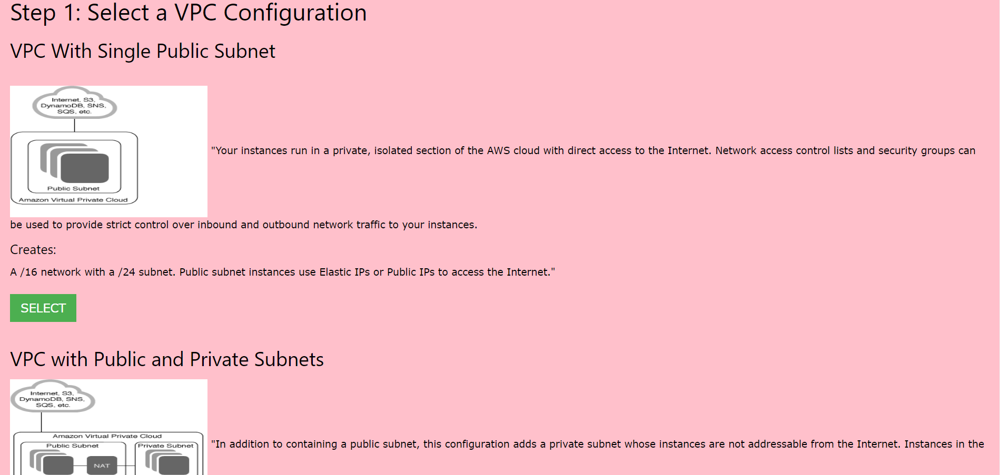

# DockerProject
### This is a simple Web Application officially termed as KZure Web Services which aims at providing Self-Service via a beautiful Web User Interface.

### The internal architecture of the services of KZure Web Services is fully containerized. Every serrvice runs sole on container and hence portable.
# The services which are provided are:
## 1) KZure PC2 : It provides a cloud Instance like AWS Service EC2
  ### STEP1: SELLECT KZURE MACHINE IMAGE
  
  
  ### STEP2: CONFIGURE KZURE PC2 INSTANCE
  
## 2) VPC Wizard: It provides a infrastructure to you similar to AWS VPC</h2>
  
  
  
## 3) Wprdpress: Single click launching of a wordpress server based on apache,php and mysql.</h2>
  
## 4) Kzure CoLab: A cloud based application for providing you a environment like Google Colab where you can run python codes.
## 5) KzureAD Covid Hotspot Points : A graphical service that provides you a high level idea of all the hotspots present in India.
## 6) FaceCounter: A service that tells you the counting of human beings in an image.
  
## 7) FaceDetection: A service that detects all the human beings give in an image.
  
 

 The backend.py file is a flask based application that contains the backend integration of this gui based self service application. 
 The html file contains all the html,css and javascript coding required for the frontend. They also contain the images .jpg , png and other image files used.

 In future many more services are planned to be added. Stay tuned for updates.

